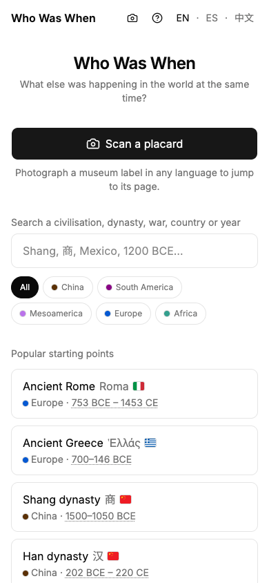
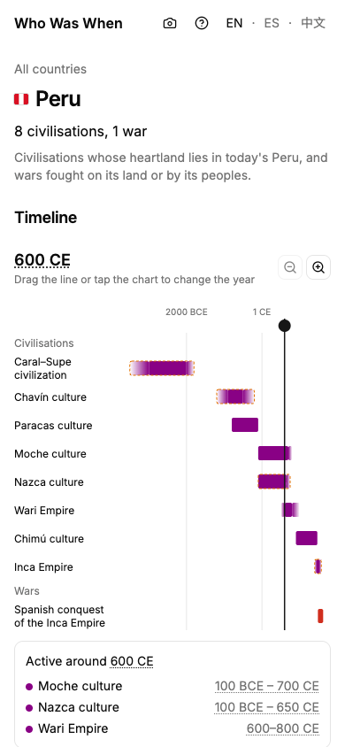

# Who Was When

Who Was When (同时代 in Chinese) answers one question: "I'm looking at this. What else was happening in
the world at the same time?" You type a civilisation, dynasty, war or year, or
photograph a museum label, and it shows what other cultures were alive at that
moment. It is built for travellers and museum visitors on a phone, often on weak
signal, and works in English, Spanish and Simplified Chinese.

Live site: https://whowaswhen.com. It was called Meanwhile until October 2026,
and the repository still is.

<p>
  
  
</p>

## What it does

- **Cultures and "meanwhile" cards.** Each culture page opens with four to six
  short cards: what was going on elsewhere in the world while it existed, one
  sentence each, with dates.
- **World timeline.** Every culture as a bar on one chart. Drag the year line
  to see who was around in that year.
- **Placard scanning.** Photograph a museum label in any language and the app
  opens the matching culture page, or shows what the label says if there is no
  match yet.
- **Territory maps.** Border maps over time for Rome, Egypt, the Carolingian and
  Holy Roman empires, seven Chinese dynasties, the Inca and the Aztecs, and for
  two wars before 1800.
- **Compare.** Two cultures side by side (three on wider screens): how long
  they overlapped, with their events on one shared timeline.
- **Before and after.** Who came before and after a culture in the same place.
- **Wars.** 39 wars, from the Greco-Persian Wars to the Russo-Ukrainian war,
  with dates, sides, events on a map, leaders and attributed death tolls. Six
  politically sensitive wars (Korea, Vietnam, the Second Sino-Japanese War, the
  Falklands, and two entries for Russia and Ukraine) appear in Spanish or
  Chinese only after a person has reviewed that language; until then they are
  in English only.
- **Country pages.** One page per present-day country: the civilisations whose
  heartland lies there and the wars fought on its land or by its peoples, on
  one timeline.

## Languages

English, Spanish (`/es/`) and Simplified Chinese (`/zh/`). The interface is
translated in full. Spanish and Chinese data text is machine-translated until
a native speaker reviews it; each culture and war file records which languages
have been reviewed.

## No Google services

The site uses no Google fonts, maps, analytics or CDNs, so it loads in
mainland China. Fonts are self-hosted and the Chinese font is cut down to the
characters the site uses. The build fails if a Google host appears anywhere a
browser can receive.

## How dates work

Years are stored as astronomical years: 1 CE is `1`, 1 BCE is `0`, 2 BCE is
`-1`. The screen never shows a year zero; it shows BCE/CE (or BC/AD, a
setting), and can show "years ago" instead.

Ancient dates are rarely exact. A culture's period has an earliest and latest
possible start and end; the bar is solid where historians agree and fades
across the uncertain edges. Dates and names that historians argue over are
marked disputed, with a note saying why.

## Data sources

Every period, event and fact cites at least one source (events at least two),
and facts are written in our own words, never copied from a source. The
[credits page](https://whowaswhen.com/en/credits/) lists every source
and what was changed.

| Source | Used for | Licence |
|---|---|---|
| [PeriodO](https://perio.do) | Period date ranges | Public domain |
| [Wikidata](https://www.wikidata.org) | Names in three languages, identifiers, coordinates | CC0 |
| [Pleiades](https://pleiades.stoa.org) | Ancient place coordinates | CC BY |
| [Cliopatria](https://github.com/Seshat-Global-History-Databank/cliopatria) | Historical borders for the territory maps | CC BY 4.0 |
| [UCDP](https://ucdp.uu.se) | Dates, sides and battle deaths of wars since 1946 | CC BY 4.0 |
| [Natural Earth](https://www.naturalearthdata.com) | Coastlines and land under the maps | Public domain |
| Correlates of War | Cross-checking war dates and sides, 1816 to 2014 | Cited only; no data included |

## Running it locally

You need Node.js 20.9 or later and pnpm.

```bash
pnpm install
pnpm dev             # http://127.0.0.1:3000
pnpm build           # checks the data, builds, then checks for Google hosts
pnpm start           # serves the build
pnpm test
pnpm typecheck
pnpm lint
pnpm validate-data   # checks every file in data/ against the schema and rules
```

Placard scanning sends the photo to Anthropic's Claude API, which reads it;
the photo is not stored or logged. To try it locally, put `ANTHROPIC_API_KEY`
in `.env.local`. Without a key everything else works and a scan answers that
scanning is unavailable.

## Project layout

[CLAUDE.md](CLAUDE.md) is the contributor guide: the layout, the data format,
the rules for writing about wars, and the conventions the code follows. The
data lives in `data/`, one JSON file per culture or war, and
`src/lib/data/schema.ts` and `src/lib/data/war-schema.ts` define the fields.

## Suggesting a correction

If a date, name or fact is wrong, open an issue with what should change and a
source that supports it (a museum, an academic work or a standard reference).
Corrections without a source can't be checked, so they can't be made.

## Licences

- Code: MIT ([LICENSE](LICENSE)), copyright J M Dimonaco LTD.
- Data in `data/`: CC BY 4.0 ([data/LICENSE](data/LICENSE)).
- Fonts, flags, map shapes and other third-party files keep their own
  licences: see [THIRD_PARTY_NOTICES.md](THIRD_PARTY_NOTICES.md).
